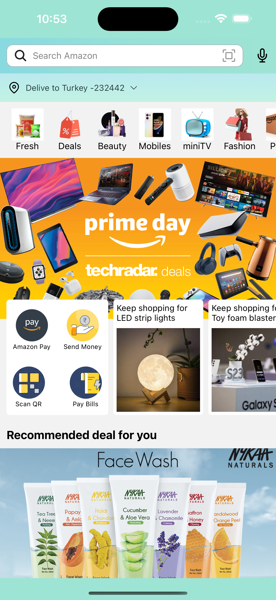
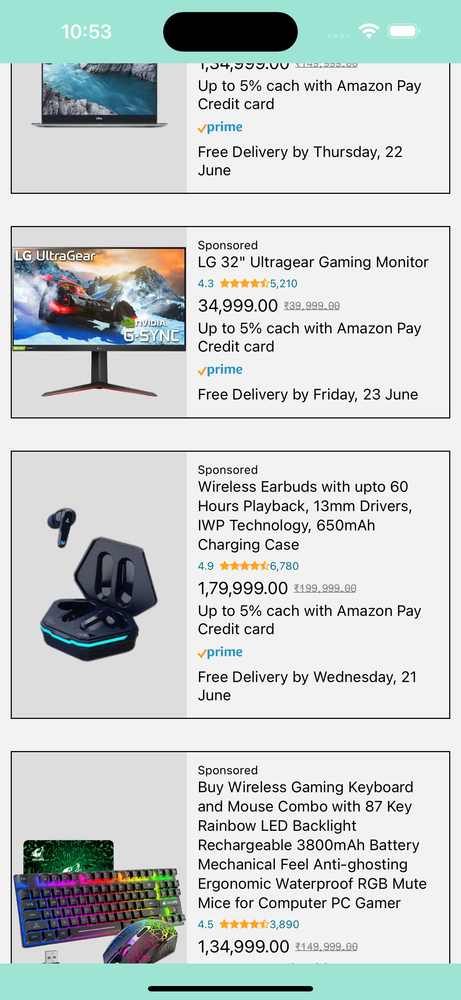

# Amazon Clone - React Native Expo

## Project Description

This project is a simple Amazon clone mobile application developed using React Native and Expo. The app features two main screens: HomeScreen and ProductScreen, allowing users to browse and view detailed information about products. Navigation between screens is managed using the react-navigation/native-stack library, and several auxiliary libraries have been integrated to enhance functionality and design.

## Video gif


## Home Screen



## Product Screen



## Features

- HomeScreen: The main screen of the app displaying popular products and categories.
- ProductScreen: Displays detailed information and images of selected products.
- Navigation: Seamless screen transitions managed by react-navigation/native-stack.
- Swiper: Allows users to swipe through product images for a better viewing experience.
- Linear Gradient: Utilized for background and button designs to create gradient effects.
- Vector Icons: Integrated using expo/vector-icons for consistent and scalable iconography.

## Technologies and Lİbraries Used

- React Native & Expo: Frameworks for building cross-platform mobile applications.
- react-navigation/native-stack: Manages navigation and screen transitions.
- expo-linear-gradient: Creates gradient effects in the app's UI components.
- expo/vector-icons: Provides a wide range of icons for use throughout the app.
- react-native-swiper: Enables swipeable views for product images.

## Requirements

To run this project locally, you will need:

- Node.js: Download Node.js
- Expo CLI:

```
npm install -g expo-cli
```

- React Native CLI: (Ensure development environment is set up for iOS and Android)
- iOS: Xcode
- Android: Android Studio

## Installation

- Clone the project to your local machine:
  git clonehttps://github.com/ozerbaykal/amazon-clone-expo.git

- Navigate to the project directory:

```
cd amazon-clone-expo
```

- Install the necessary packages:

```
npm install
```

### Starting the Development Server

```
npm start

```

- Run on Emulator or Device:

### Use an Android or iOS emulator.

- Use an Android or iOS emulator.
- Alternatively, scan the QR code with your physical device using the Expo Go app.
  Libraries Used

<h2>Contributing</h2>

Contributions are welcome! Please open an issue first to discuss what you would like to change.

- 1.Fork the project
- 2.Create your feature branch (git checkout -b feature/NewFeature)
- 3.Commit your changes (git commit -m 'Add new feature')
- 4.Push to the branch (git push origin feature/NewFeature)
- 5.Open a Pull Request

<h2>Contact</h2>

Özer BAYKAL mail : baykalozer87@gmail.com

Project Link: https://github.com/ozerbaykal/amazon-clone-expo/tree/main
